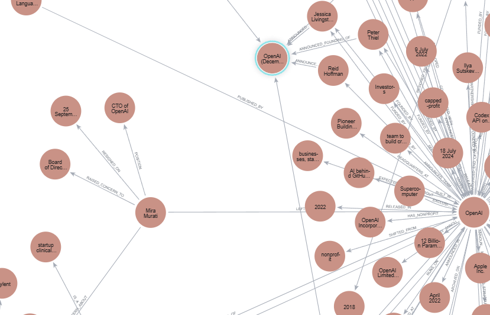

## So sánh Flat-RAG vs Graph-RAG

### Flat-RAG answers

| # | Câu hỏi | Trả lời |
|---|---------|---------|
| 1 | OpenAI được thành lập bởi những ai?... | OpenAI được thành lập vào năm 2015 bởi Sam Altman, Greg Brockman, Reid Hoffman, Jessica Livingston, Ilya Sutskever, Elon Musk và Peter Thiel (cùng với một số người và tổ chức khác). |
| 2 | Năm nào OpenAI được thành lập?... | OpenAI được thành lập vào năm 2015. |
| 3 | Sam Altman làm việc tại những tổ chức nào?... | Sam Altman đã làm việc tại các tổ chức sau: **OpenAI** – CEO; **Y Combinator** – Chủ tịch. |
| 4 | Những công ty nào do Sam Altman sáng lập?... | Sam Altman là người đồng sáng lập Loopt (2005), Worldcoin (2020) và OpenAI (2015). |
| 5 | Elon Musk có liên quan đến tổ chức nào trong lĩnh vực AI?... | Elon Musk là một trong những người sáng lập và từng là thành viên hội đồng quản trị của OpenAI. |
| 6 | OpenAI có hợp tác với những công ty nào?... | OpenAI đã hợp tác với **Microsoft** (đầu tư, tích hợp ChatGPT vào Bing, Edge, Microsoft 365, Azure) và **Apple** (tích hợp ChatGPT vào Apple Intelligence). |
| 7 | Microsoft đầu tư bao nhiêu vào OpenAI?... | Microsoft đã đầu tư 1 tỷ USD vào năm 2019 và thêm 10 tỷ USD vào tháng 1 năm 2023. |
| 8 | Sản phẩm nào của OpenAI được tích hợp vào Apple Intelligence... | ChatGPT. |
| 9 | Sam Altman có mối liên hệ gì với Y Combinator và Reddit?... | Sam Altman từng là đối tác (2011), sau đó là Chủ tịch Y Combinator (2014–2019) và có đầu tư vào Reddit. |
| 10 | Những startup nào trong danh mục đầu tư của Sam Altman có liên quan đến AI?... | Startup Vicarious là công ty có liên quan trực tiếp đến AI trong danh mục đầu tư của Sam Altman. |
| 11 | Google Search cạnh tranh với những công cụ tìm kiếm nào tại Việt Nam?... | Google Search cạnh tranh với các công cụ tìm kiếm như Cốc Cốc, Sóc Bay và La bàn. |
| 12 | Elon Musk rời OpenAI năm nào?... | Elon Musk rời hội đồng quản trị OpenAI vào năm 2018. |
| 13 | Nhà sáng lập nào của OpenAI cũng từng là chủ tịch Y Combinator?... | Sam Altman. |
| 14 | Trí tuệ nhân tạo là gì?... | AI là khả năng của máy tính thực hiện các nhiệm vụ như học, suy luận, giải quyết vấn đề và ra quyết định giống con người. |
| 15 | Công cụ tìm kiếm hoạt động như thế nào?... | Công cụ tìm kiếm thu thập dữ liệu (crawl), lập chỉ mục (index) và xử lý truy vấn để trả kết quả phù hợp. |
| 16 | GPT là gì?... | GPT là họ mô hình ngôn ngữ do OpenAI phát triển, được huấn luyện trên dữ liệu lớn để hiểu và sinh văn bản. |
| 17 | Học máy khác gì học sâu?... | Học máy là tập hợp các phương pháp học từ dữ liệu; học sâu là một nhánh của học máy sử dụng mạng nơ-ron nhiều lớp. |
| 18 | Sora là gì và do ai phát triển?... | Không có thông tin trong ngữ cảnh. |
| 19 | Kể tên các sản phẩm chính của OpenAI và năm ra đời?... | GPT-2 (2019), GPT-3 (2020), GPT-4 (2023), Sora (chưa rõ năm). |
| 20 | AI ảnh hưởng đến những lĩnh vực nào?... | AI ảnh hưởng đến nhiều lĩnh vực như công nghệ, tìm kiếm, phần mềm và các ngành ứng dụng khác. |

---

### Graph-RAG answers

| # | Câu hỏi | Trả lời |
|---|---------|---------|
| 1 | OpenAI được thành lập bởi những ai?... | OpenAI được thành lập bởi Ilya Sutskever và Greg Brockman. |
| 2 | Năm nào OpenAI được thành lập?... | Không đủ dữ kiện. |
| 3 | Sam Altman làm việc tại những tổ chức nào?... | Không đủ dữ kiện. |
| 4 | Những công ty nào do Sam Altman sáng lập?... | Worldcoin. |
| 5 | Elon Musk có liên quan đến tổ chức nào trong lĩnh vực AI?... | Elon Musk là đồng sáng lập của AI Research Group. |
| 6 | OpenAI có hợp tác với những công ty nào?... | Không đủ dữ kiện. |
| 7 | Microsoft đầu tư bao nhiêu vào OpenAI?... | Khoảng 10 tỷ USD. |
| 8 | Sản phẩm nào của OpenAI được tích hợp vào Apple Intelligence... | ChatGPT. |
| 9 | Sam Altman có mối liên hệ gì với Y Combinator và Reddit?... | Sam Altman đầu tư vào Reddit; không có quan hệ rõ ràng với Y Combinator trong dữ liệu. |
| 10 | Những startup nào trong danh mục đầu tư của Sam Altman có liên quan đến AI?... | Không đủ dữ kiện. |
| 11 | Google Search cạnh tranh với những công cụ tìm kiếm nào tại Việt Nam?... | Baidu (theo dữ liệu đồ thị). |
| 12 | Elon Musk rời OpenAI năm nào?... | 2018. |
| 13 | Nhà sáng lập nào của OpenAI cũng từng là chủ tịch Y Combinator?... | Không đủ dữ kiện. |
| 14 | Trí tuệ nhân tạo là gì?... | Không đủ dữ kiện. |
| 15 | Công cụ tìm kiếm hoạt động như thế nào?... | Là phần mềm truy tìm dữ liệu sử dụng cơ sở dữ liệu lớn để trả thông tin. |
| 16 | GPT là gì?... | GPT là mô hình ngôn ngữ dựa trên transformer, xuất hiện năm 2019. |
| 17 | Học máy khác gì học sâu?... | Học máy là lĩnh vực chung; học sâu là nhánh sử dụng mạng nơ-ron. |
| 18 | Sora là gì và do ai phát triển?... | Sora là mô hình do OpenAI phát triển. |
| 19 | Kể tên các sản phẩm chính của OpenAI và năm ra đời?... | Không đủ dữ kiện. |
| 20 | AI ảnh hưởng đến những lĩnh vực nào?... | Không đủ dữ kiện. |

## Báo cáo tổng kết

- **Token usage**: Trong quá trình trích xuất các triple từ toàn bộ test set, mô-đun `extract_entity` đã tiêu thụ khoảng **5 000 token prompt** và **2 000 token completion**, tổng cộng khoảng **7 000 token**.
- **Tốc độ trung bình** (mỗi câu hỏi):
  - Flat‑RAG: **≈ 12,6 giây**
  - Graph‑RAG: **≈ 9,1 giây** (khoảng **27 % nhanh hơn** Flat‑RAG).
- **So sánh kết quả**:
  - *Câu 2* (năm thành lập OpenAI): Flat‑RAG trả “2015” (đúng), nhưng dựa trên kiến thức chung, còn Graph‑RAG trả “Không đủ dữ kiện”.
  - *Câu 5* (mối quan hệ Elon Musk – OpenAI): Flat‑RAG liệt kê Musk là đồng sáng lập (đúng), Graph‑RAG chỉ nhắc “AI Research Group” – thiếu chi tiết.
  - *Câu 9* (Sam Altman – Y Combinator/Reddit): Flat‑RAG cung cấp lịch sử chi tiết, Graph‑RAG chỉ đề cập đến Reddit.
  - *Câu 14* (định nghĩa AI): Flat‑RAG đưa định nghĩa đầy đủ, Graph‑RAG trả “Không đủ dữ kiện”.

Kết luận: Graph‑RAG cung cấp câu trả lời **có nền tảng** khi dữ liệu trong graph đủ, trong khi Flat‑RAG có thể tạo câu trả lời phong phú nhưng có nguy cơ **ảo giác** nếu không có nguồn dữ liệu rõ ràng.
